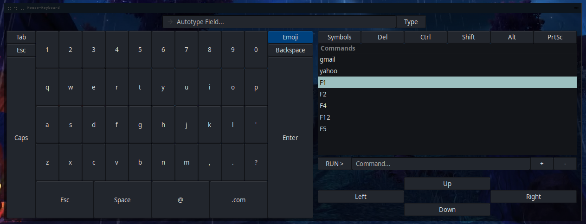

# Mouse-Keyboard
An onscreen keyboard for the mouse.

### Requirements
* PyGObject
* python-xlib
* pyautogui
* setproctitle
* fast-autocomplete[levenshtein]

# TODO
<li>Get save and execute of custom commands working.</li>

# Images

